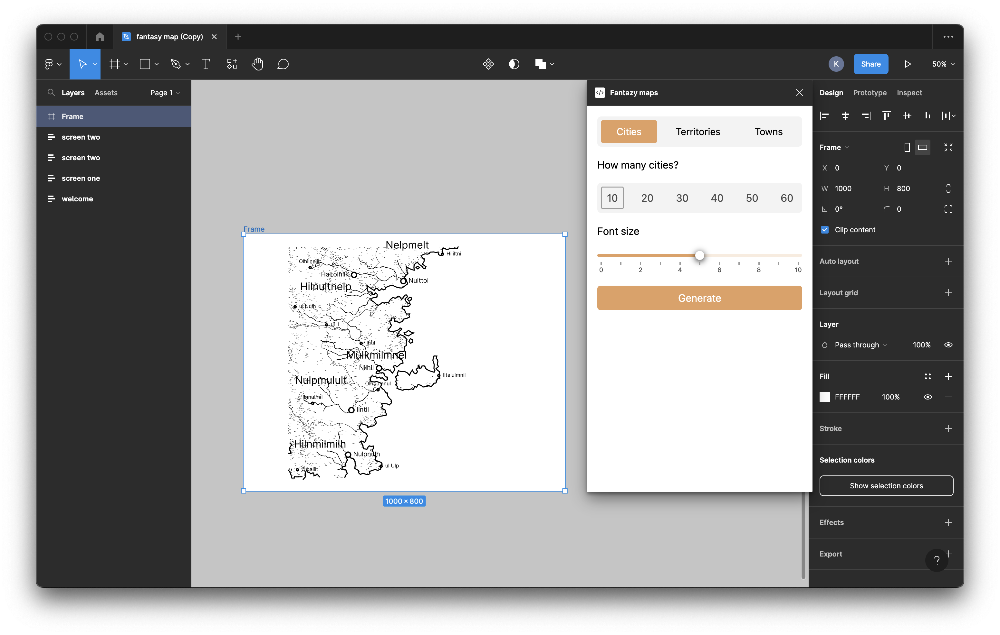

# Fantazy Maps

Fantazy Maps is a Figma plugin that allows users to quickly generate random maps with names for use in adventure book. The plugin utilizes RNG (random number generation) to create unique maps and names with a single click. This makes it easy for users to quickly prototype their adventure book layouts without having to spend hours creating custom maps from scratch.

## Key Features

Random Map Generation: The plugin generates random maps with a variety of terrain types such as forests, mountains, rivers, deserts, and more.

Name Generation: The plugin generates unique and creative names for the maps.

Customization: The plugin allows users to customize certain aspects of the map such as the size, scale, and complexity.

Quick Prototyping: The plugin allows designers to quickly prototype their adventure book layouts with unique maps and names, saving them time and effort.

## How it Works

Install the Fantazy Maps plugin in Figma.
Open a new or existing Figma file and select the Fantazy Maps from the plugins menu.

Click on the "Generate" button and wait for the plugin to create a random map with unique names.

Customize the map as needed using the options provided.

Use the generated map and name in your adventure book layout.

## Conclusion

Fantazy Maps plugin is a tool for users who want to quickly prototype their adventure book layouts. With its ability to generate unique maps and names using RNG, users can save time and effort.